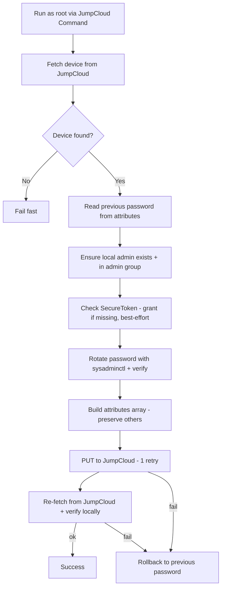

<div align="center">

# JumpCloud LAPS for macOS

**Local Administrator Password Solution for macOS — rotates the local admin password and stores it securely in the JumpCloud device record.**

[](https://support.apple.com/en-us/HT208050)
[](#prerequisites)
[](https://jumpcloud.com/)
[](LICENSE)
[](#overview)

</div>

> 🪟 **Looking for the Windows version?** See
> [jumpcloud-laps-windows](https://github.com/rahultestingjc/jumpcloud-laps-windows).

---

## Overview

A **LAPS** (Local Administrator Password Solution) for macOS that uses **JumpCloud device
custom attributes as the password vault**.

On each run the script ensures a managed local admin account exists, rotates its password to a
strong random value, and syncs that password to the device's JumpCloud record. The previous
password is preserved for **rollback**, and the script performs a full **round-trip
verification** — fetching the password back from JumpCloud and confirming it authenticates on
the device — before declaring success.

> **Why it matters:** every Mac ends up with a unique, regularly rotated local admin password,
> centrally retrievable from JumpCloud — no shared static admin password across the fleet.

---

## Table of Contents

- [Highlights](#highlights)
- [At a glance](#at-a-glance)
- [How it works](#how-it-works)
- [Repository structure](#repository-structure)
- [Prerequisites](#prerequisites)
- [Deployment](#deployment)
- [Configuration](#configuration)
- [Security notes](#security-notes)
- [License](#license)

---

## Highlights

- 🔑 **Unique, rotated admin password per device** — strong 12-char random password every run.
- 🗄️ **JumpCloud as the vault** — stored in the device's custom attributes, retrievable by admins.
- 🔐 **SecureToken check** — verifies the managed admin's SecureToken and grants it
  (best-effort, non-blocking) via a token-holding admin when it's missing.
- ↩️ **Safe rollback** — on any sync or verification failure, restores the previous password and
  verifies it still works (or prints a recovery password as a last resort).
- ✅ **Round-trip verification** — re-fetches the password from JumpCloud and authenticates it
  locally with `dscl -authonly` before reporting success.
- 🧮 **Attribute-safe writes** — scopes parsing to the `attributes` array so other system fields
  never cause "Attribute names must be unique" errors, and preserves existing attributes.

---

## At a glance

| Script | Platform | What it does |
|--------|----------|--------------|
| [`JC-LAPS.sh`](scripts/JC-LAPS.sh) | macOS (zsh) | Rotates the local admin password and syncs it to the JumpCloud device record, with SecureToken handling, rollback, and verification |

---

## How it works



---

## Repository structure

```
jumpcloud-laps-macos/
├── README.md
├── LICENSE
├── .gitignore
├── .gitattributes
└── scripts/
    └── JC-LAPS.sh
```

---

## Prerequisites

- A macOS device **managed by JumpCloud** (enrolled agent).
- A JumpCloud **API key** with permission to read and update systems
  (`GET`/`PUT /systems/{id}`), since the password is stored in the device's custom attributes.
- The managed admin account must be resettable from its current password (the script rotates
  via `sysadminctl -resetPasswordFor`).
- (Optional) An existing **SecureToken-holding admin account** — used to grant SecureToken to
  the managed admin when it lacks one. This is best-effort: if it isn't available or the grant
  fails, the script logs a warning and still rotates the password.
- The script runs as **root**.

---

## Deployment

Dispatch from JumpCloud as a **Command** (run as `root`) targeting macOS devices.

1. In the JumpCloud Admin Console, create a new **Command** → **Mac** → command type **Bash**.
2. Paste the contents of [`JC-LAPS.sh`](scripts/JC-LAPS.sh).
3. Provide the configuration values (see [Configuration](#configuration)).
4. Run it on a schedule (e.g. recurring) or on demand to rotate and re-vault the password.

---

## Configuration

These placeholders at the top of the script are substituted by JumpCloud at dispatch time:

```bash
JC_API_KEY={{Apikey}}
JC_SYSTEM_ID={{device.id}}
DEFAULT_LOCAL_ADMIN_PASSWORD={{AdminPass}}
SECURE_TOKEN_ADMIN={{SecureTokenAdmin}}
SECURE_TOKEN_ADMIN_PASSWORD={{SecureTokenAdminPass}}
```

- **`{{Apikey}}`** — JumpCloud **Automation Variable** (admin-created); the real key is injected
  at dispatch time and never stored in source.
- **`{{device.id}}`** — **built-in** command variable, resolved automatically.
- **`{{AdminPass}}`** — Automation Variable: default/seed password used when no prior password
  exists in JumpCloud (used on first run / account creation).
- **`{{SecureTokenAdmin}}` / `{{SecureTokenAdminPass}}`** — Automation Variables for an existing
  SecureToken-holding admin, used to grant SecureToken to the managed admin when missing
  (best-effort; the script continues even if the grant can't be performed).
- **`LOCAL_ADMIN_USERNAME`** — the managed admin account name (default `admin`); the JumpCloud
  attribute storing the password uses this same name.

> ⚠️ **Never hardcode real credentials.** Use JumpCloud **Automation Variables** so secrets are
> injected only at dispatch time.

> 🌍 **EU-region tenants:** if your JumpCloud org is in the EU region, change `BASE_URL` in the
> script from `https://console.jumpcloud.com/api` to `https://console.eu.jumpcloud.com/api`.

---

## Security notes

- The rotated password is stored as a JumpCloud **device custom attribute**. Restrict which
  admins/roles can read device attributes accordingly — that is your vault access control.
- On rollback failure the script prints recovery passwords to the command output (visible in
  JumpCloud command results) as a deliberate last-resort recovery aid. Treat command output as
  sensitive and limit who can view it.
- Use an API key scoped to the **least privilege** needed (systems read/update).

---

## License

Released under the [MIT License](LICENSE).

---

<div align="center">

Built to keep JumpCloud-managed Macs secure with unique, rotating admin passwords. 🔐

</div>
